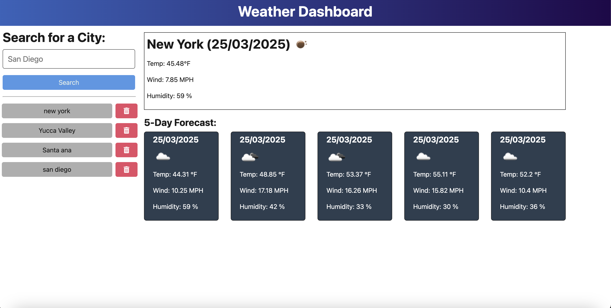

# Module 09 - Weather Dashboard

**Program:** UC Irvine Full-Stack Web Development (Nov 2024 - June 2025)
**Stack:** TypeScript / Node.js / Express / Vite / OpenWeather API / Bootstrap 5


---

## Table of Contents

- [Objective](#objective)
- [What It Does](#what-it-does)
- [Screenshot](#screenshot)
- [How To Run](#how-to-run)
- [Project Structure](#project-structure)
- [What It Demonstrates](#what-it-demonstrates)
- [License](#license)

---

## Objective

Build a full-stack weather dashboard where users can search any city and get current conditions plus a 5-day forecast, with search history persisted on the server.

---

## What It Does

Users type a city name into the search bar. The frontend sends the request to the Express backend, which calls OpenWeather's geocoding API to resolve coordinates, then hits the 5-day forecast endpoint. The server returns formatted weather data — temperature, wind speed, humidity, and weather icons — for today and the next five days.

Searched cities are saved to a JSON file on the server and surfaced as clickable history buttons. Each history entry can be deleted individually. The frontend is vanilla TypeScript compiled with Vite — no framework, just DOM manipulation and `fetch` calls.

---

## Screenshot



---

## How To Run

**Prerequisites:** You need a free [OpenWeather API key](https://openweathermap.org/api).

```bash
# 1. Install all dependencies (root, server, and client)
npm run install

# 2. Add your API key
cp server/.env.example server/.env
# then edit server/.env and set API_KEY=your_key_here

# 3. Start in development mode (server + client run concurrently)
npm run start:dev
```

- Frontend: `http://localhost:5173`
- Backend API: `http://localhost:3001`

For production: `npm start` builds the client and serves everything from Express on port 3001.

---

## Project Structure

```
module09-weather-dashboard/
├── client/
│   ├── index.html
│   └── src/
│       ├── main.ts              # All frontend logic - fetch, render, event handlers
│       └── styles/
│           └── jass.css         # Custom styles on top of Bootstrap
├── server/
│   └── src/
│       ├── server.ts            # Express app setup, static file serving
│       ├── routes/
│       │   ├── index.ts         # Route aggregator
│       │   ├── htmlRoutes.ts    # Catch-all fallback to serve index.html
│       │   └── api/
│       │       └── weatherRoutes.ts  # POST /weather, GET /history, DELETE /history/:id
│       ├── service/
│       │   ├── weatherService.ts    # OpenWeather API calls + data parsing
│       │   └── historyService.ts    # Read/write city history to JSON file
│       └── data/
│           └── searchHistory.json   # Persisted search history
├── package.json                 # Root scripts (concurrently, build, deploy)
└── server/.env.example          # Copy to .env and add your API key
```

---

## What It Demonstrates

- Full-stack architecture with a clear client/server split
- REST API design with Express — POST, GET, and DELETE routes
- Third-party API integration using OpenWeather's geocoding and forecast endpoints
- TypeScript on both client and server with separate `tsconfig.json` per layer
- Vite as a frontend build tool (no React, no framework)
- Persistent data layer using filesystem JSON instead of a database
- Environment variable management with `dotenv`

---

## License

This project is licensed under the [MIT License](https://opensource.org/licenses/MIT).
