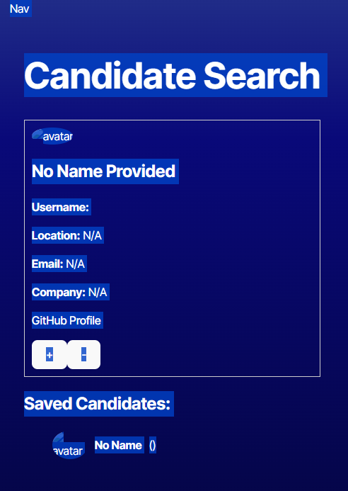

# Module 13 - Candidate Search

**Program:** UC Irvine Full-Stack Web Development (Nov 2024 - June 2025)
**Stack:** React 18 / TypeScript / Vite / React Router DOM v6 / GitHub API / localStorage


---

## Table of Contents

- [Objective](#objective)
- [What It Does](#what-it-does)
- [Screenshot](#screenshot)
- [How To Run](#how-to-run)
- [Project Structure](#project-structure)
- [What It Demonstrates](#what-it-demonstrates)
- [Notes](#notes)
- [License](#license)

---

## Objective

Build a React + TypeScript app that pulls real GitHub users via the GitHub API and presents them as hiring candidates — accept or reject one at a time, with accepted candidates persisted to localStorage and viewable on a separate saved list page.

---

## What It Does

On load, the app fetches a batch of GitHub users and then enriches each with a second API call to get full profile details (name, location, company, email, bio). Users are shown one at a time with their avatar and details. Clicking `+` saves them to localStorage and advances to the next; clicking `-` skips. When the batch runs out, the page reports no more candidates.

The Saved Candidates page reads from localStorage and renders the saved list with full profile info and a per-entry Remove button that updates both state and storage. The app was deployed to Render during the course.

If the GitHub API is unavailable or the token is missing, the API layer falls back to hardcoded fake candidates so the UI stays functional.

---

## Screenshot



---

## How To Run

**Prerequisites:** A free [GitHub personal access token](https://github.com/settings/tokens).

```bash
# 1. Install dependencies
npm install

# 2. Add your GitHub token
cp environment/.env.example environment/.env
# edit environment/.env and set VITE_GITHUB_TOKEN=your_token_here

# 3. Start the dev server
npm run dev
```

Opens at `http://localhost:5173`.

---

## Project Structure

```
module13-candidate-search/
├── src/
│   ├── App.tsx                          # Root layout - Nav + React Router Outlet
│   ├── main.tsx                         # Router setup with createBrowserRouter
│   ├── api/
│   │   └── API.tsx                      # GitHub API calls + User type + fake data fallback
│   ├── components/
│   │   ├── Nav.tsx                      # Navigation component (stub - see Notes)
│   │   └── CandidateCard.tsx            # Candidate display card
│   ├── interfaces/
│   │   └── Candidate.interface.tsx      # Interface file (stub - see Notes)
│   └── pages/
│       ├── CandidateSearch.tsx          # Main page - fetch, accept/reject loop, localStorage write
│       ├── SavedCandidates.tsx          # Saved list page - read from localStorage, remove entries
│       └── ErrorPage.tsx               # 404 fallback
├── environment/
│   └── .env.example                     # Copy to .env and set VITE_GITHUB_TOKEN
├── screenshot.png
└── vite.config.ts
```

---

## What It Demonstrates

- React Router DOM v6 with `createBrowserRouter`, nested layouts, and `<Outlet />`
- TypeScript interfaces for API response typing (`User` in `API.tsx`)
- Chained async API calls - batch user fetch followed by `Promise.all` for per-user detail enrichment
- `localStorage` for client-side persistence across page reloads
- `useEffect` with localStorage initialization via lazy state initializer
- Graceful API fallback - fake candidate data when GitHub token is absent or rate-limited
- Vite environment variables via `import.meta.env.VITE_GITHUB_TOKEN`

---

## Notes

`Nav.tsx` and `Candidate.interface.tsx` are stubs — the assignment scaffolded these files but the implementation landed elsewhere. The User type lives in `API.tsx`, and navigation was not wired into the Nav component. The core functionality (search, save, remove, persistence) is fully implemented.

---

## License

This project is licensed under the [MIT License](https://opensource.org/licenses/MIT).
